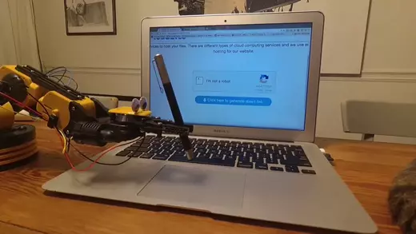

# King Of Time App Log
A simple selenium automation script to login and logout for King of Time log.
The setup is suitable for a Always On PC or a raspberry-pi, since it uses cron
jobs to run this script.
The script is running chrome browser in headless mode, so you don't need a
display to run this script.



## Requirements
* Python 3.8
* Selenium
* ConfigArgParse
```
pip install -r requirements.txt
```
* Chromedriver
For webdriver to work, you need to first install chromedriver. Follow the
instructions at this
[link](https://qiita.com/pyon_kiti_jp/items/0ba98f140142d4ac6b25).

* Check your version of Chrome browser.
* Download the chromedriver for that particular version from this
  [link](https://sites.google.com/a/chromium.org/chromedriver/downloads).
* Unzip it and move it to a directory in your path.
```
cd /tmp/
curl -O <chromedriver_of_your_browser_version>
unzip chromedriver_linux64.zip
sudo mv chromedriver /usr/local/bin/

## Login Details
Change the username and password 

## Crontab Instructions
Change the time as per your liking:
```
PATH=/usr/local/sbin:/usr/local/bin:/usr/sbin:/usr/bin:/sbin:/bin:/usr/games:/usr/local/games:/snap/bin
30 19 * * WED DISPLAY=:0 /home/sp/auto_env/bin/python /home/sp/repos/automate_boring_stuff/automate_king_of_time.py --clock_status Out > /tmp/king_app.log 2>&1
```
